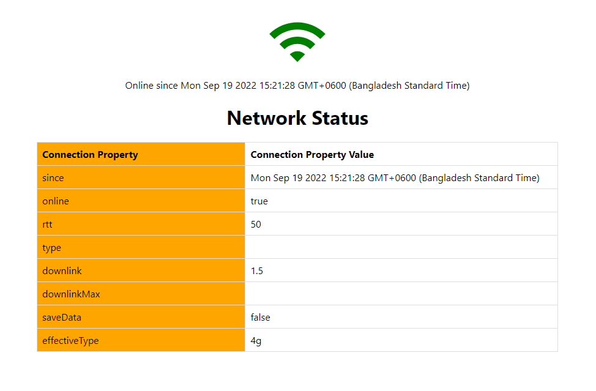

# Practical React: (Network-Status)

## Vivek Joy: useNetwork (YouTube)

---

useNetwork (Custom-Hook) : [useNetwork - custom react hook to detect network status](https://www.youtube.com/watch?v=0aPHx-eZ1s8)

---

📷 Screen Shots:

